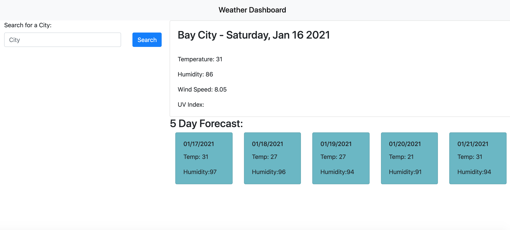
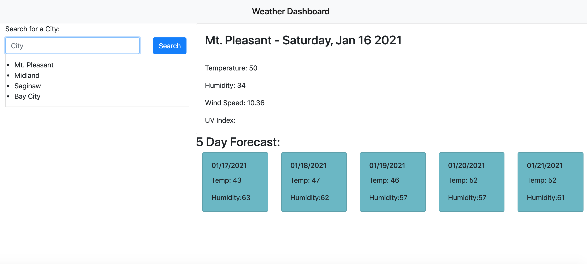

# Weather-App

### Goal

The main goal of the application is to allow a user to search for a city. When the user searches for a city, the city's current weather data, 5 day forecast, and search history are populated.

To do so we needed code to:

-Create a place for the user to enter data
-Use a button to send that data to local storage and call the weather APIs
-Use the API data to add info to the HTML to display to the user
-Be able to refresh the page and keep the last search item's data up to display

### Struggles

The UV index was something I couldn't find. Also, the formatting of the appended items was always off. Took a long time to figure out how to make those look correct.

### Screenshots

Here is a screenshot for what it looks like when you open the page:

Here is a screenshot with what it looks like with a randomly generated 10 character password:

### Link

Here is the link to the application:
[Password Generator](https://chappand.github.io/Weather-App/)